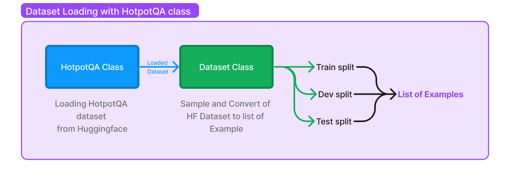

# Utilizing Inbuilt Datasets

DSPy offers support for loading several popular datasets, enabling you to swiftly begin implementing and experimenting with DSPy pipelines. As of now DSPy provides support for the following dataset out of the box:

* **HotPotQA**
* **GSM8k**
* **Color**


## Loading HotPotQA

Let's go ahead and import an existing dataset in DSPy i.e. HotPotQA which is basically a bunch of question answer pairs. One convinient thing that data modules makes convinient for us is that it'll convert all the QA-pairs to Example objects for us.

```python
from dspy.datasets import HotPotQA

dataset = HotPotQA(train_seed=1, train_size=5, eval_seed=2023, dev_size=50, test_size=0)

print(dataset.train)
```
**Output:**
```text
[Example({'question': 'At My Window was released by which American singer-songwriter?', 'answer': 'John Townes Van Zandt'}) (input_keys=None),
 Example({'question': 'which  American actor was Candace Kita  guest starred with ', 'answer': 'Bill Murray'}) (input_keys=None),
 Example({'question': 'Which of these publications was most recently published, Who Put the Bomp or Self?', 'answer': 'Self'}) (input_keys=None),
 Example({'question': 'The Victorians - Their Story In Pictures is a documentary series written by an author born in what year?', 'answer': '1950'}) (input_keys=None),
 Example({'question': 'Which magazine has published articles by Scott Shaw, Tae Kwon Do Times or Southwest Art?', 'answer': 'Tae Kwon Do Times'}) (input_keys=None)]
```

We just loaded trainset ( examples) and devset (50 examples). Each example in our training set contains just a question and its (human-annotated) answer. As you can see it is loaded as a list of `Example` objects. However, one thing to note is that it doesn't set the input keys implicitly, so that is something that we'll need to do!!

```python
trainset = [x.with_inputs('question') for x in dataset.train]
devset = [x.with_inputs('question') for x in dataset.dev]

print(trainset)
```
**Output:**
```text
[Example({'question': 'At My Window was released by which American singer-songwriter?', 'answer': 'John Townes Van Zandt'}) (input_keys={'question'}),
 Example({'question': 'which  American actor was Candace Kita  guest starred with ', 'answer': 'Bill Murray'}) (input_keys={'question'}),
 Example({'question': 'Which of these publications was most recently published, Who Put the Bomp or Self?', 'answer': 'Self'}) (input_keys={'question'}),
 Example({'question': 'The Victorians - Their Story In Pictures is a documentary series written by an author born in what year?', 'answer': '1950'}) (input_keys={'question'}),
 Example({'question': 'Which magazine has published articles by Scott Shaw, Tae Kwon Do Times or Southwest Art?', 'answer': 'Tae Kwon Do Times'}) (input_keys={'question'})]
```

DSPy typically requires very minimal labeling. Whereas your pipeline may involve six or seven complex steps, you only need labels for the initial question and the final answer. DSPy will bootstrap any intermediate labels needed to support your pipeline. If you change your pipeline in any way, the data bootstrapped will change accordingly!


## Inside DSPy's `Dataset` class

We've seen how you can use `HotPotQA` dataset class and load the HotPotQA dataset, but do you wonder how does it work? Actually `HotPotQA` class inherits `Dataset` class which takes care of the conversion of the data loaded from a source to train-test-dev split all of which are *list of examples*. Whereas in `HotPotQA` class you only implement `__init__` class where you populate the splits from HuggingFace into the variables `_train`, `_test` and `_dev`. Rest of the process is handled by methods in the `Dataset` class.



But how does `Dataset` class methods convert the data from HuggingFace? Let's take a deep breath and think step by step...pun intended. In example above we can see the splits being accessed by `.train`, `.dev` and `.test` methods. Wait methods, where are the `()`? Yep let's see the implementation of `train()` method:

```python
@property
def train(self):
    if not hasattr(self, '_train_'):
        self._train_ = self._shuffle_and_sample('train', self._train, self.train_size, self.train_seed)

    return self._train_
```

As you can see, the `train()` method is actually a property, not a regular method. This means it can be accessed like an attribute without parentheses. Inside the train property, it first checks if the `_train_` attribute exists. If not, it calls the `_shuffle_and_sample()` method to process the `self._train` where dataset from HuggingFace is loaded. Let's see the  `_shuffle_and_sample()` method:

```python
def _shuffle_and_sample(self, split, data, size, seed=0):
    data = list(data)
    base_rng = random.Random(seed)

    if self.do_shuffle:
        base_rng.shuffle(data)

    data = data[:size]
    output = []

    for example in data:
        output.append(Example(**example, dspy_uuid=str(uuid.uuid4()), dspy_split=split))
    
        return output
```

The `_shuffle_and_sample()` method does two things:

* It shuffles the data if `self.do_shuffle`` is True.
* It then takes a sample of size `size` from the shuffled data.
* It then loops through the sampled data and converts each element in `data` into an `Example` object. The `Example` along with example data also contains a unique ID, and the split name.

Converting the raw examples into `Example` objects allows the Dataset class to process them in a standardized way later. For example, the collate method, which is used by the PyTorch DataLoader, expects each item to be an `Example`.

So in summary, the `Dataset` class handles all the necessary data processing and provides a simple API to access the different splits. The actual dataset classes like HotpotQA only need to define how to load the raw data.
